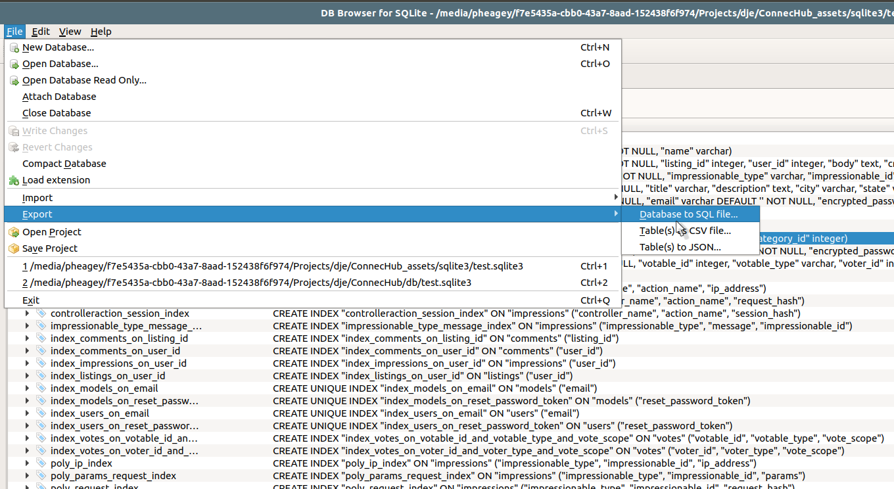
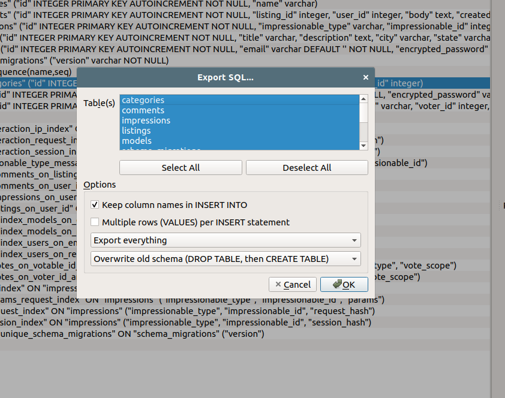
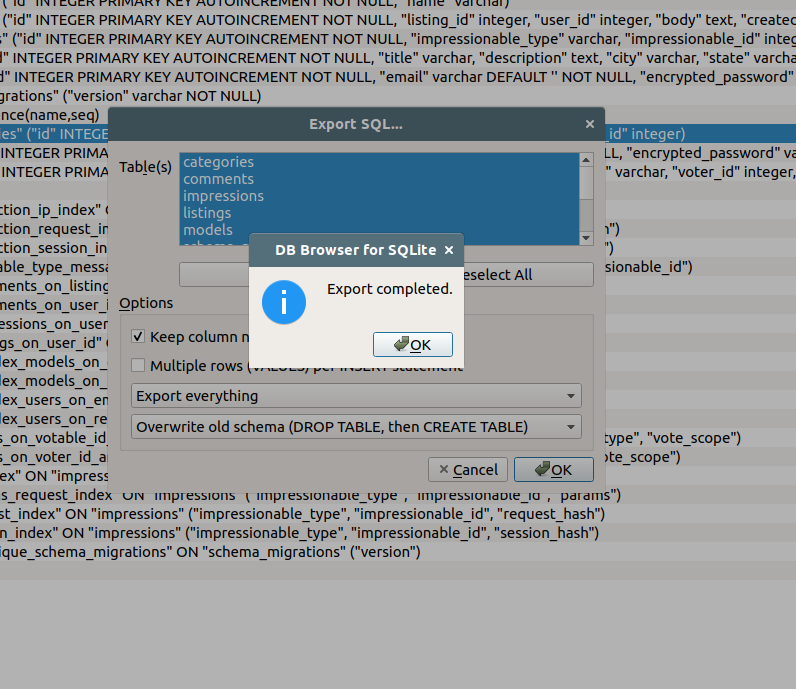

# sqlite3 to MariaDB 10.x Migration

1) Download source SQLite3 file

```bash
scp -i {ssh key credential} {user}@{address}:/source/dir/*.sqlite3 /target/local/dir/
```

2) Use DB Browser for SQLite3 to export as SQL



...then...



After clicking 'OK' select the location ./input/database.sql as the location and file name.

...then...



3) Execute ./migrate.sh

```bash
./migrate.sh
```

4) Import ./ouput/database.sql to target database

```bash
mysql -u ${username} -p${password} -h ${host} < ./ouput/database.sql
```